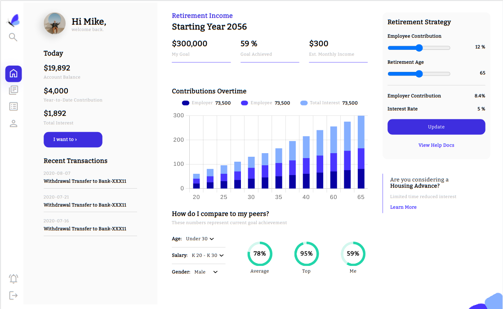
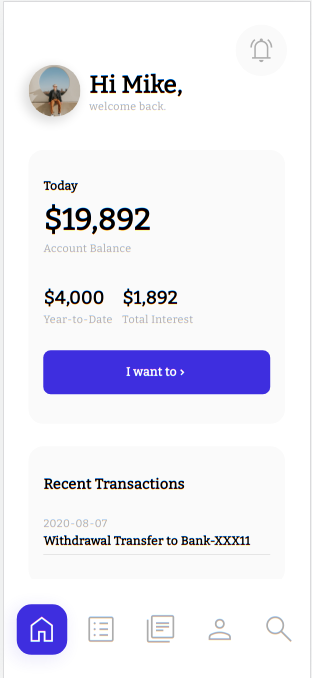
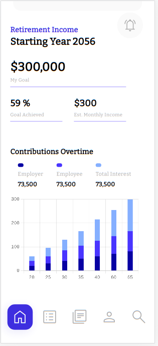
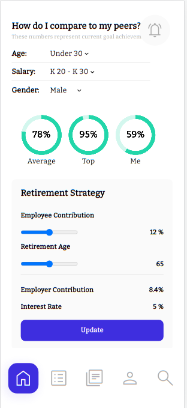

# Frontend Development Internship Assignment

This repository contains my submission for the Frontend Development Internship Assignment. In this project, I was tasked with creating a responsive website based on the provided design. The website should adapt its layout for both laptop and mobile phone views.

## Table of Contents

- [Technologies Used](#technologies-used)
- [Getting Started](#getting-started)
- [Site Preview](#site-preview)
  - [Laptop View](#laptop-view)
  - [Mobile View](#mobile-view)
- [Deployment](#deployment)

## Technologies Used

- HTML5
- CSS3
- JavaScript
- React
- ChartJs

## Getting Started

To view the website locally on your machine, follow these steps:

1. Clone this repository to your local machine using the following command:

   ```
   git clone git@github.com:amuwal/urk-markup.git
   ```

2. Navigate to the project directory:

    ```
    cd urk-markup
    ```

3. Install the dependencies using npm or yarn:

    ```
    npm install
    ```

    or

    ```
    yarn install
    ```

4. Start the development server:
    ```
        npm start run
    ```
    or
    ```
        yarn start run
    ```
5. Open your web browser and visit http://localhost:3000 to view the website.

Now, the React website should be up and running on your local machine. 

Please note that these steps assume you have Node.js and npm (Node Package Manager) or yarn installed on your machine. If you haven't installed them yet, you can download the latest stable version of Node.js from the official website: https://nodejs.org/


## Site Preview

### Laptop View



The website is designed to be fully responsive on laptops, ensuring that all elements are well-arranged and visually coherent on larger screens.

### Mobile View

The website has been tested on multiple mobile devices to ensure a seamless user experience. Below are snapshots of how the website appears on different mobile devices:










## Deployment

The live version of the website can be accessed at [https://amuwal.github.io/urk-markup/]
